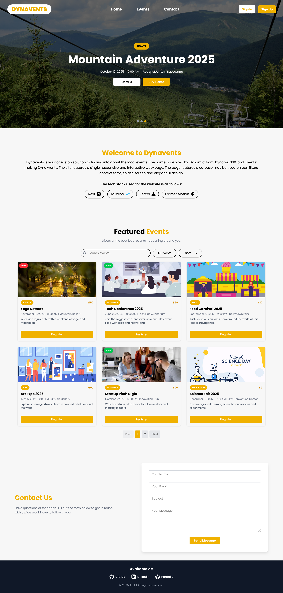

# Featured Events Site

A single page responsive and interactive webiste made for a case study assigned by Dynamic360

## Deployment

Deployed on Vercel :
<https://dynavents-hq3s.vercel.app>

## Repository

Repo on Github :
<https://github.com/PERPELEX/Dynavents>

## Tech Stack

- **Next JS**
- **Tailwind CSS**
- **Vercel**
- **Framer Motion**

## Features

- **NavBar**
- **Carrasoul**
- **Search Bar**
- **Filter & Sort**
- **Contact Form**
- **Splash Screen**
- **Clean UI**
- **Pagination**
- **Responsive**

## Objectives

| Objective # | Objective                                                                                                   | Implementation                                                                                                                                                |
| ----------- | ----------------------------------------------------------------------------------------------------------- | ------------------------------------------------------------------------------------------------------------------------------------------------------------- |
| 1.1         | A top navigation bar containing the site logo and links to “Home,” “Events,” and “Contact.”                 | ✅Implemented with dropdown for mobile screens                                                                                                                |
| 1.2         | A hero section with a short heading:                                                                        | ✅Made hero section using carasoul featuring top products                                                                                                     |
| 1.3         | A section titled “Featured Events” that displays 3–5 sample events.                                         | ✅Made Featured Events Section showing 6 events for Desktop and 4 events for mobile at a time with pagination to move btw pages.                              |
| 1.4         | Each Event Card Should Include Event name, Date and time, Location, Short description and “Register” button | ✅Made Event card witl all given attributes along with category and popularity                                                                                |
| 2.1         | Use a simple, clean UI                                                                                      | ✅Developed a clean UI. (Took inspiration from a pintrest design)                                                                                             |
| 2.2         | Ensure the page is fully responsive                                                                         | ✅Fully Responsive for all screens                                                                                                                            |
| 3.1         | Add a search bar that filters events by name.                                                               | ✅Added a search bar that searches through not just name but category and description as well. Along with it added asscending and Descending sort and filters |
| 3.2         | Load event data dynamically using dummy JSON                                                                | ✅Made a dummy json file in public with 12 data items and loaded them dynamically.                                                                            |

## Known Issues

None as of yet.

**⚠️⚠️Note: Contact form is made using web3forms API key present in .env.local so, it wont work on your local machine in case you clone it. For it to work you can either test it on real website or make your own web3forms key and place it in .env.local in root directory. The name of env variable is NEXT_PUBLIC_WEB3FORMS_API_KEY⚠️⚠️**

## How to Start

```bash

npm i
npm run dev

```

## Screenshots

### Featured Events


